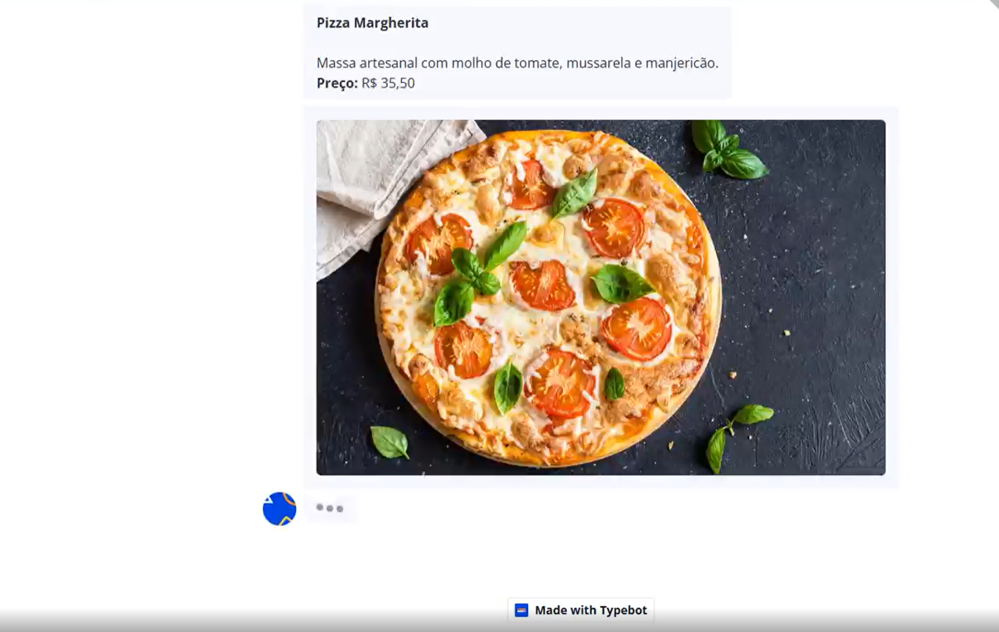

# Chatbot de Restaurante com Typebot e API Java



## Descrição do Projeto
Este é um chatbot para restaurantes criado com [Typebot](https://typebot.io/), integrado a uma API em Java para registrar pedidos e gerenciar o sistema de vendas. O projeto conta com uma interface para clientes, vendedores e administradores.

## Tecnologias Utilizadas
- **Typebot**: Para criação do chatbot interativo
- **Java (Spring Boot)**: API backend
- **JPA (Java Persistence API)**: Gerenciamento de banco de dados
- **Spring Security**: Autenticação e segurança
- **MySQL**: Banco de dados
- **Ngrok**: Exposição da API local para o chatbot

## Funcionalidades
- **Cliente**: Faz pedidos via chatbot
- **Vendedor**: Gerencia pedidos
- **Administrador**: Gerencia usuários e cardápio
- **Segurança**: Autenticação com Spring Security

## Como Executar
### Backend (API Java)
1. Clone o repositório:
   ```sh
   git clone https://github.com/6gusta/Chatnot_Pedidos.git
   ```
2. Acesse a pasta do projeto:
   ```sh
   cd 6gusta
   ```
3. Configure o banco de dados MySQL no **application.properties**:
   ```properties
   spring.datasource.url=jdbc:mysql://localhost:3306/seu_banco
   spring.datasource.username=seu_usuario
   spring.datasource.password=sua_senha
   ```
4. Execute a aplicação:
   ```sh
   mvn spring-boot:run
   ```
5. Utilize o **Ngrok** para expor a API:
   ```sh
   ngrok http 8080
   ```

### Chatbot (Typebot)
1. Acesse [Typebot.io](https://typebot.io/) e crie um novo bot
2. Configure as requisições HTTP para chamar a API usando a URL do **Ngrok**
3. Publique e teste o chatbot


## Contribuição
Contribuições são bem-vindas! Fique à vontade para abrir issues e pull requests.

## Autor
Desenvolvido por [Luiz Gustavo[(https://github.com/6gusta/Chatnot_Pedidos.git).

